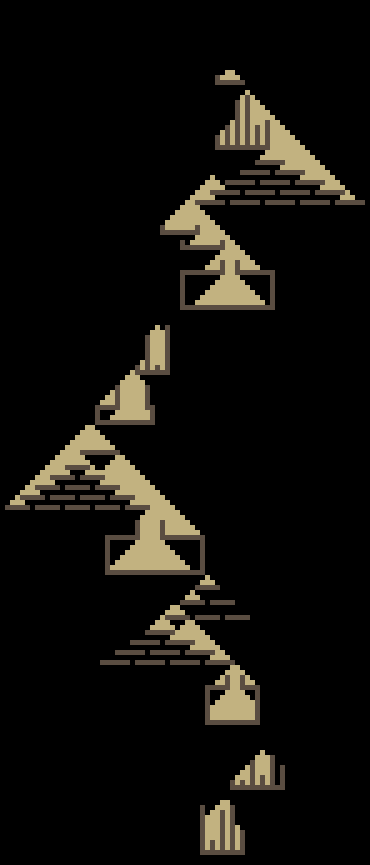

# Day 14 (Regolith Reservoir)

## Part 1 & 2

A beautiful problem that needs to repeat a logic. The logic itself seems quite
simple, and with careful implementations the result can be stunning!

## Visualizations

### Part 1

### Part 2

